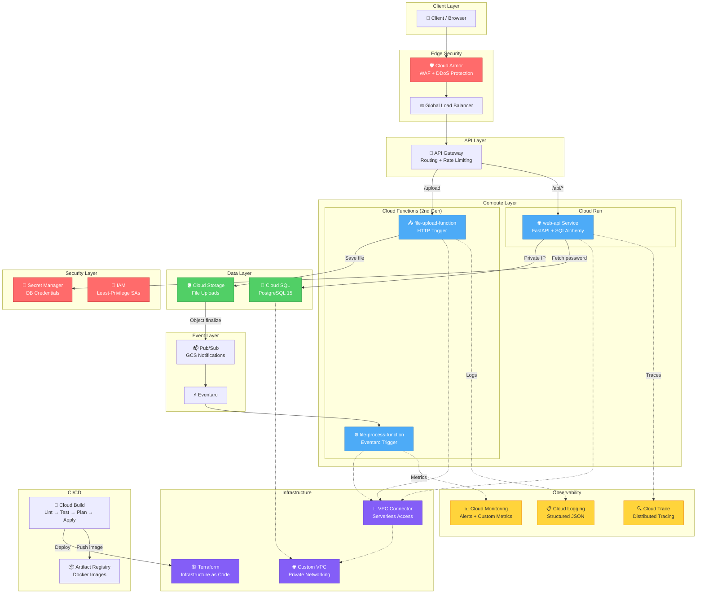

# Architecture — Enterprise Serverless Platform on GCP

## System Architecture Diagram

## Request Flow

### File Upload Flow
1. Client sends `POST /upload` with `multipart/form-data`
2. Cloud Armor inspects the request (WAF rules, rate limiting)
3. Global Load Balancer forwards to API Gateway
4. API Gateway routes to `file-upload-function`
5. Function saves the file to Cloud Storage bucket
6. GCS emits an `OBJECT_FINALIZE` event via Pub/Sub
7. Eventarc triggers `file-process-function`
8. Process function logs metadata and increments custom metric

### API Request Flow
1. Client sends `GET /api/items`
2. Cloud Armor → Global LB → API Gateway
3. API Gateway routes to Cloud Run `web-api` service
4. Service fetches DB password from Secret Manager (cached)
5. Service queries Cloud SQL via private IP (VPC Connector)
6. Response returned through the same path

## Security Architecture

| Layer | Component | Purpose |
|-------|-----------|---------|
| Edge | Cloud Armor | WAF (XSS, SQLi), IP blocking, rate limiting |
| Network | Custom VPC | Private networking, no public IPs on data tier |
| Identity | IAM Service Accounts | Least-privilege access per service |
| Secrets | Secret Manager | DB credentials secured, not in env vars |
| Data | Cloud SQL | Private IP only, encrypted at rest |

## Observability Stack

| Pillar | Tool | Implementation |
|--------|------|----------------|
| Logs | Cloud Logging | Structured JSON with `severity` + `service_context` |
| Metrics | Cloud Monitoring | Custom `files_processed_count` counter + alerts |
| Traces | Cloud Trace | Distributed tracing across API Gateway → Cloud Run |
